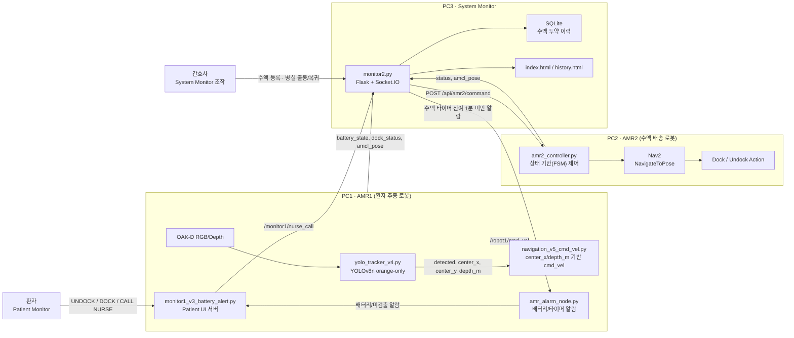

# SUWAGBOT

**AMR 두 대가 협업하여 수액 투약 환자의 이동을 보조하고, 간호사 요청에 따라 수액 물품을 병실로 자동 배송하는 ROS 2 통합 시스템** 


**두산로보틱스 지능형 로보틱스 엔지니어(ROKEY) 부트캠프 · SLAM 기반 자율주행 프로젝트**

---

## Overview

`SUWAGBOT`은 병동 환경에서 **수액 투약 환자의 이동 부담**과 **간호사의 반복적인 비간호 업무 부담**을 줄이기 위한 Proof of Concept(PoC) 수준의 AMR 협업 시스템입니다.

* 수액 투약 환자는 이동 시 수액 거치대를 직접 조작해야 하며, 좁은 공간 이동이나 방향 전환 시 부담이 커집니다.
* 간호사는 전문 간호 업무 외에도 수액 준비, 병실 이동, 상태 확인 같은 반복적인 비간호 업무를 함께 수행합니다.

SUWAGBOT은 이 두 문제를 **AMR1(환자 추종/수액 거치 로봇)**, **AMR2(수액 배송 로봇)**, **System Monitor(통합 관제)** 세 요소를 하나의 흐름으로 연동해 해결합니다.

> 환자가 이동을 시작하면 AMR1이 수액을 거치한 채로 환자를 따라가고, 수액 부족/교체가 필요하면 환자는 Patient Monitor에서 간호사를 호출합니다. 간호사는 System Monitor에서 호출을 확인하고 AMR2를 지정 병실로 출동시켜 수액을 배송하며, 교체가 끝나면 AMR2는 자동으로 복귀·도킹합니다.

본 시스템은 실제 의료기기 수준의 수액 잔량 센서나 병원 EMR 연동을 목표로 하지 않으며, 병동 환경에서의 AMR 협업 구조 가능성을 검증하는 데모 시스템입니다.

---

## Key Features

### AMR1 — 환자 추종 / 수액 거치 로봇

* OAK-D RGB/Depth 영상과 YOLOv8n(**orange-only, no-freeze**) 모델로 오렌지 식별 띠를 검출
* 검출 중심좌표(`center_x`)로 방향을 보정하고, Depth 값(`depth_m`) 기준 약 1m 거리를 유지하며 환자를 추종
* Undock 시 자동으로 인식·추종 시작, Dock 상태에서는 불필요한 트래픽 감소를 위해 detector 비활성화
* 배터리 부족 / 수액 타이머 잔여 1분 미만 / 환자 미검출 상황에 대한 알람 처리
* Patient Monitor(환자용 웹 UI)를 통한 배터리·도킹 상태 확인, DOCK/UNDOCK 제어, 간호사 호출

### AMR2 — 수액 배송 로봇

* System Monitor의 출동/복귀 명령을 상태 기반(FSM: `WAIT_GO` → `이동` → `WAIT_RETURN` → `복귀` → `DOCKED`)으로 처리
* 지정된 병실(101/102/103호) 좌표로 Nav2 기반 자율 이동
* 작업 완료 후 지정 복귀 좌표로 이동, Dock Action 수행 후 대기 상태로 자동 복귀 — 반복 배송 가능

### System Monitor — 통합 관제

* Flask + Socket.IO + SQLite 기반 간호사 스테이션 웹 대시보드
* 신규 수액 투약 등록(환자/간호사 정보, 수액 종류, 용량) 및 투약 이력 조회
* 환자 호출 상태, AMR1/AMR2 배터리·도킹 상태, AMCL 기반 실시간 위치 지도 표시
* AMR2 병실 출동/복귀 명령 전송, 수액 타이머 관리 및 잔여 시간 1분 미만 시 AMR1에 알람 신호 발행

---

## System Architecture



### 서브시스템 구성

| Subsystem | 주요 구성 | 역할 |
| --- | --- | --- |
| AMR1 (환자 추종) | `yolo_tracker_v4.py`, `navigation_v5_cmd_vel.py`, `amr_alarm_node.py`, `monitor1_v3_battery_alert.py` | 환자 인식·추종, 수액 타이머 알람, Patient Monitor, 도킹/언도킹 상태 관리 |
| AMR2 (수액 배송) | `amr2_controller.py`, `amr2_control_interface` | 수액 배송, 병실 목적지 이동, 복귀 이동, 도킹/대기 상태 전환 |
| Monitoring | `monitor2.py`, `templates/index.html`, `templates/history.html` | 환자 호출 확인, 수액 투약 등록, 투약 이력 조회, 로봇 상태·위치 관제, AMR2 목적지 선택 |
| Navigation | Nav2, AMCL, `navigation_v5_cmd_vel.py` | 위치 추정, 목표 좌표 이동, 장애물 회피, AMR1 추적 보조, AMR2 복귀·도킹 연동 |

전체 데이터 흐름: `AMR1 인식/추종` → `Monitoring(호출·타이머·상태·DB)` → `AMR2 배송/복귀/도킹` → `Navigation(위치추정·경로계획)`

---

## Repository Structure

```text
D-1_지능1_suwagbot/
├── D-1_지능1_Design_Doc.pdf          # Software Design Document (SDD)
├── D-1_지능1_시스템_설계도.drawio      # 시스템 아키텍처 다이어그램
└── src/
    ├── final_project/                # AMR1: 환자 추종 / Patient Monitor
    │   ├── final_project/
    │   │   ├── yolo_tracker_v4.py            # YOLOv8n orange-only 검출 노드
    │   │   ├── navigation_v5_cmd_vel.py       # center_x/depth_m 기반 cmd_vel 추종 제어
    │   │   ├── amr_alarm_node.py              # 배터리·수액 타이머 알람 → TurtleBot4 오디오
    │   │   ├── monitor1_v3_battery_alert.py   # Patient Monitor Flask 서버
    │   │   └── templates/
    │   │       ├── monitor1.html
    │   │       ├── monitor1_led.html
    │   │       └── monitor1_led_battery_alert.html
    │   ├── launch/monitor_navigation.launch.py
    │   └── best.pt                            # YOLOv8n orange-only no-freeze 가중치
    │
    ├── amr2_control/                 # AMR2: 상태 기반(FSM) 배송 제어
    │   └── amr2_control/amr2_controller.py
    │
    ├── amr2_control_interface/       # AMR2 커스텀 메시지
    │   └── msg/Amr2ControlSignal.msg
    │
    └── system_monitor/               # 통합 관제(System Monitor)
        └── system_monitor/
            ├── monitor2.py                    # Flask + Socket.IO 서버
            ├── templates/{index.html, history.html}
            └── static/{map.png, map.yaml, map4.pgm}   # 병동 맵(AMCL)
```

### ROS 2 패키지

| 패키지 | 빌드 타입 | 주요 역할 |
| --- | --- | --- |
| `final_project` | `ament_python` | AMR1 인식·추종 제어, 알람, Patient Monitor 웹 서버 |
| `amr2_control` | `ament_python` | AMR2 상태 기반 배송·복귀·도킹 제어 |
| `amr2_control_interface` | `ament_python` | AMR2 제어 신호 커스텀 메시지 정의 |
| `system_monitor` | `ament_python` | 간호사 스테이션 통합 관제 웹 서버, SQLite 연동 |

---

## Custom Interfaces / API

### ROS 2 Topics — AMR1 (환자 인식/추종)

| 토픽 | 타입 | 방향 | 설명 |
| --- | --- | --- | --- |
| `/robot1/events/yolo_tracker_enable` | `std_msgs/Bool` | Subscribe | 도킹 상태에 따라 detector 활성/비활성화 |
| `/robot1/tracked_target/detected` | `std_msgs/Bool` | Publish | 추적 대상(orange 띠) 검출 여부 |
| `/robot1/tracked_target/label` | `std_msgs/String` | Publish | 검출된 클래스 이름 |
| `/robot1/tracked_target/confidence` | `std_msgs/Float32` | Publish | 검출 신뢰도 |
| `/robot1/tracked_target/center_x`, `center_y` | `std_msgs/Float32` | Publish | 검출 박스 중심 좌표 |
| `/robot1/tracked_target/depth_m` | `std_msgs/Float32` | Publish | 대상까지의 거리 |
| `/robot1/cmd_vel` | `geometry_msgs/Twist` | Publish | 추종 주행 속도 명령 |
| `/robot1/battery_state` | `sensor_msgs/BatteryState` | Subscribe | AMR1 배터리 상태 |
| `/robot1/dock_status` | `irobot_create_msgs/DockStatus` | Subscribe | AMR1 도킹 상태 |
| `/monitor1/nurse_call` | `std_msgs/Bool` | Publish | 간호사 호출 신호 |

### ROS 2 Topics / Action — AMR2 (수액 배송)

| 인터페이스 | 타입 | 설명 |
| --- | --- | --- |
| `amr2_control_interface/msg/Amr2ControlSignal` | `int64 room_id`, `bool go` | System Monitor → AMR2 출동 명령 페이로드 |
| `/robot5/navigate_to_pose` | `nav2_msgs/action/NavigateToPose` | 지정 병실/복귀 좌표 이동 |
| `/robot5/dock`, `/robot5/undock` | Action | AMR2 도킹 / 언도킹 수행 |
| `/robot5/dock_status` | `irobot_create_msgs/DockStatus` | AMR2 도킹 상태 |
| `/robot5/amcl_pose` | `geometry_msgs/PoseWithCovarianceStamped` | AMR2 현재 위치 |

### REST API — System Monitor (Flask)

| Endpoint | Method | 설명 |
| --- | --- | --- |
| `/` , `/history-page` | GET | System Monitor 메인 화면 / 투약 이력 화면 |
| `/api/infusion` | POST | 신규 수액 투약 정보 등록 → SQLite 저장, 타이머 시작 |
| `/api/history` | GET | 저장된 누적 투약 이력 조회 |
| `/api/amr2/command` | POST | AMR2 출동(`room_id`, `go`) / 복귀 명령 전송 |
| `/api/calls/nurse-check` | POST | 간호사 호출 확인 처리 |

### Socket.IO Events

| 이벤트 | 설명 |
| --- | --- |
| `robot_update` | AMR1/AMR2 배터리, 도킹 상태, AMCL 위치 갱신 |
| `nurse_call` | 환자 호출 상태 갱신 |

### Infusion Record DB (SQLite)

| Field | 타입 | 설명 |
| --- | --- | --- |
| `patient_id`, `patient_name` | Text | 환자 ID / 이름 |
| `nurse_id`, `nurse_name` | Text | 간호사 ID / 이름 |
| `fluid_name` | Text | 수액 종류 |
| `volume` | Integer/Float | 투약 용량 |
| `started_at`, `estimated_end_at` | DateTime | 투약 시작 / 예상 종료 시간 |

---

## Prerequisites

### 하드웨어

* TurtleBot4 (iRobot® Create® 3 Mobile Base + Raspberry Pi 4B 4GB) × 2대 — AMR1, AMR2
* OAK-D Pro RGB-D Stereo Camera (AMR1)
* RPLIDAR A1 2D LiDAR (AMR1, AMR2)
* 제어용 PC 3대 (PC1: AMR1 / PC2: AMR2 / PC3: System Monitor)
* 동일 Wi-Fi 내부망 (Wi-Fi 6 권장)

### 소프트웨어 요구사항

* Ubuntu 22.04 LTS, ROS 2 Humble
* Nav2, AMCL
* Python 3, OpenCV, Ultralytics YOLOv8
* Flask, Socket.IO, SQLite3
* TurtleBot4 관련 패키지 (`turtlebot4_navigation`, `irobot_create_msgs` 등)

### Python 의존성

```bash
pip install --user \
  ultralytics \
  opencv-python \
  numpy \
  flask \
  flask-socketio
```

---

## Build

```bash
cd ~/rokey_pjt   # 워크스페이스 경로는 환경에 맞게 변경

source /opt/ros/humble/setup.bash

colcon build
source install/setup.bash
```

> `yolo_tracker_v4.py`의 `YOLO_MODEL_PATH`는 실행 환경의 실제 경로(`.../src/final_project/best.pt`)에 맞게 확인이 필요합니다.

## Run

로봇 드라이버(TurtleBot4 bringup), Nav2, AMCL은 각 AMR에서 별도로 먼저 실행되어야 합니다.

### 1. AMR1 (PC1) — 인식/추종/Patient Monitor

```bash
source install/setup.bash
ros2 launch final_project monitor_navigation.launch.py
```

### 2. AMR2 (PC2) — 배송 제어

```bash
source install/setup.bash
ros2 run amr2_control amr2_controller
```

### 3. System Monitor (PC3)

```bash
source install/setup.bash
ros2 run system_monitor monitor2
```

실행 후 웹 브라우저에서 System Monitor(간호사 스테이션)와 Patient Monitor(AMR1 연결) 화면에 접속해 통합 시나리오(수액 요청 → AMR2 배송 → AMR1 추적 → 복귀)를 확인합니다.

---

## Team & Roles

| 담당 | 이름 | 주요 역할 |
| --- | --- | --- |
| 총괄 / 문서 / YOLO | 오승연 | PM, 일정 관리, System Design 통합, YOLO 데이터 수집·학습·비교, SDD/PPT 문서 주도 |
| AMR1 제어 | **이주헌** | YOLO 모델 기반 객체 감지 노드 구현, AMR1 제어 노드 통합 |
| AMR1 제어 보조 | 서정민 | YOLO 검출 객체와 일정 거리를 유지하는 객체 추종 노드 개발 |
| AMR2 제어 | 이윤종 | 상태 기반 제어 로직, System Design / Flow Chart |
| System Monitor | 노혜은 | System Monitor2 개발, AMR1·AMR2 통합 테스트 |
| System Monitor | 유정완 | 웹 GUI 구현, Patient UI 개발, YOLO 학습 데이터 수집, cmd_vel 기반 AMR1 제어 개발 보조 |
| AMR2 제어 | 전이준 | 지정 좌표 이동, 복귀·Dock Action 수행 로직 개발 |
| 지원 | 김현우 | 개발 지원 |
| 멘토 | Andy Kim | 시스템 설계도 및 프로젝트 구성 방향 피드백 |

---

## Key Issues & Resolutions

| 이슈 | 원인 | 해결 |
| --- | --- | --- |
| 네트워크 지연(ping 30~4000ms) | 공유기 버퍼/리소스 과부하 추정 | 공유기 재시작, 시연 전 네트워크 상태 점검 절차화 |
| YOLO 오검출 (하체 전체 인식 시 벽/배경 depth 오참조) | 다리 사이 배경이 중심좌표에 포함 | 검출 대상을 **orange 식별 띠만**으로 축소, 거리 다양성 데이터 추가 수집 |
| freeze 학습 성능 저하 | freeze 단계가 많을수록 성능 저하 | **no-freeze** 학습 방식 채택 |
| 모델 버전 선택 | v8n·v11n mAP 유사, 실시간성 필요 | 추론 속도 우위인 **YOLOv8n** 채택 (mAP50 99.5%, mAP50-95 83.8%) |
| AMR1 추종 시 방향 튐 / 끊김 | Navigation 경유 시 재검출 후 방향 오정렬 | Nav2 대신 **직접 cmd_vel 계산**으로 전환, 도킹 상태 기반 detector on/off |
| AMR2 좁은 공간 경로 생성 실패 | costmap `inflation_radius` 과대(0.5) | `inflation_radius` 0.2로 조정 |
| 수동 Initial Pose 설정 불편 | 매 시연마다 RViz 수동 지정 필요 | 코드에서 `initial_pose` 자동 발행 |
| 반복 배송 불가 | 일회성 이동 로직 | 상태 기반(FSM) 로직으로 반복 배송 가능하도록 개선 |
| Localization 오류 | bringup 완료 전 localization 실행 | bringup 노드 확인 후 실행, map topic·QoS(`transient_local`) 조정 |

---

## 발표 피드백 및 후속 조치

최종 발표 Q&A/평가에서 받은 피드백과 그에 대한 현황·개선 방향을 정리합니다.

| 피드백 | 내용 | 현황 및 대응 방향 |
| --- | --- | --- |
| cmd_vel 직접 제어의 한계 | AMR1 추종 시 Nav2를 거치지 않고 cmd_vel을 직접 계산·발행하는 방식이라, 장애물 회피를 포함한 자율주행이 동작하지 않음 | 알려진 트레이드오프로 인지하고 있으며, Nav2 + Depth 기반 장애물 회피를 결합한 추종 방식으로 개선 예정 (Roadmap 참고) |
| **AI 모델 선정 (가장 큰 문제로 지적됨)** | 사람 인식·추종이라는 문제에 bounding-box 기반 YOLOv8n(orange-only) 검출 모델이 최적의 솔루션은 아니었다는 평가 | 사람의 자세/관절 좌표를 직접 활용할 수 있는 **YOLO-pose 계열 모델** 도입을 최우선 개선 항목으로 검토 중 |
| Depth 사용 여부에 대한 오해 | Depth 값을 사용하지 않는다는 인상이 전달됨 | 실제로는 `depth_m` 값을 AMR1 거리 유지(약 1m 추종)의 핵심 입력으로 사용 중이며(`navigation_v5_cmd_vel.py`, SDD 5.1.1 참조), 발표자료에서 이 부분 설명을 보강할 필요 |

---

## Roadmap / TODO

* [ ] **(최우선)** 사람 인식/추종에 적합한 **YOLO-pose 모델**로 전환 검토 — bounding-box 기반 orange-only 검출의 한계에 대한 발표 피드백 반영
* [ ] cmd_vel 직접 제어 대신 Nav2 + Depth 기반 장애물 회피를 결합한 추종 방식 연구 (자율주행/장애물 회피 미지원 문제 해결)
* [ ] 구현되어 있으나 문서화되지 않은 기능을 식별하여 README/SDD에 반영
* [ ] 발표자료에 Depth 기반 거리 유지 로직을 더 명확히 설명 (실제 사용 중임을 명시)
* [ ] 수액 타이머 time-out 알림을 Patient UI에서도 수신하도록 개선 (알람 소리 미청취 대비)
* [ ] 병원 내 시설(수납창구, 검사실 등) 좌표 저장 및 길안내 모드 추가
* [ ] AMR1 구조 안정성 개선 (낮은 무게중심, 하중 분산, 수액 거치부 고정, 속도/가감속 제한)
* [ ] YOLO `patient`/`person` 객체 검출을 활용한 회피 로직 추가
* [ ] 수액 잔량 센서 연동으로 타이머 기반 방식 대체
* [ ] 101/102/103호 외 병실 목적지 확장
* [ ] 간호사 계정/권한 분리 등 사용자 인증 기능 추가

> 현재 시스템은 병동 환경을 가정한 Proof of Concept(PoC) 데모이며, 실제 의료기기 수준의 수액 센서·EMR 연동은 범위에 포함되지 않습니다.

---

## Documentation

| 경로 | 내용 |
| --- | --- |
| `D-1_지능1_Design_Doc.pdf` | Software Design Document — 시스템 개요, 아키텍처, 데이터 설계, 상세 설계, HMI, 성능/오류처리, 테스트/배포 계획 |
| `D-1_지능1_시스템_설계도.drawio` | ROS 2 노드/토픽 아키텍처 다이어그램 |

---

<div align="center">

본 프로젝트는 Doosan Robotics ROKEY 지능형 로보틱스 엔지니어 과정의 지능1 프로젝트로 수행되었습니다.

</div>
